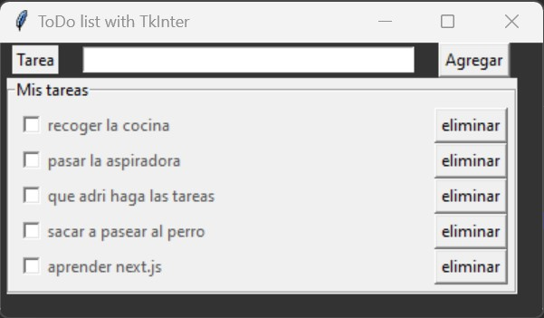

# TaskList_TkInter
Lista de tareas utilizando la librería TkInter

Se trata de lista de tareas. 
Utilizando la librería Tkinter, el código se reduce a tal punto que tenemos un sólo archivo aparte de la base de datos.

Es muy útil conocer los elementos que tenemos disponibles de una manera tan rápida y cómoda junto a la instalación de python

